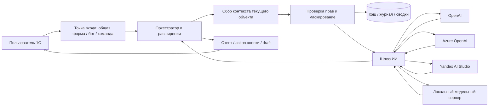
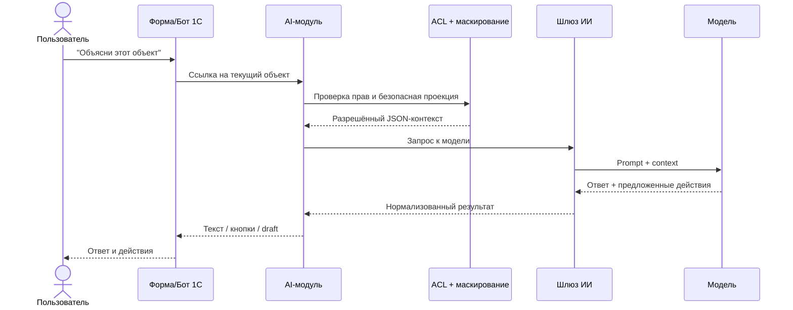

# Универсальная ИИ‑доработка для 1С с красивым встроенным чат‑интерфейсом

## Executive summary

Для задачи «универсальной доработки» под 1С оптимальной выглядит не одна конкретная форма, а **слой оркестрации в расширении конфигурации** с несколькими точками входа: базовая — **общая управляемая форма** с чат‑панелью, альтернативная — **бот/чат на базе Системы взаимодействия**, а для сложных сценариев — гибрид с HTML‑рендерингом внутри формы. Такой подход хорошо ложится на архитектуру платформы: 1С различает thin/web/mobile client modes, поддерживает HTML‑документы в форме, контекстные обсуждения, ботов и — начиная с версии 8.3.27 — нативный WebSocket‑клиент. citeturn20view0turn19view7turn37view0turn37view1turn37view6

Если цель — **минимум конфликтов с поддержкой типовой конфигурации**, то первичным вариантом должна быть **доработка через расширение**, а не изменение основной конфигурации и не логика, вынесенная в внешние обработки. Расширения предназначены именно для адаптации типовых решений под внедрение; кроме того, в расширениях можно создавать собственные web- и HTTP‑сервисы, а через API проверять, меняет ли расширение структуру данных. Внешние обработки и отчёты удобны для PoC и админских сценариев, но официальный стандарт 1С требует особенно осторожно относиться к внешнему коду и по умолчанию ограничивать его интерактивный запуск. citeturn19view0turn19view1turn18view0turn30view0

С точки зрения вызова ИИ, **REST + streaming (SSE)** — базовый и самый переносимый вариант; **WebSocket** нужен там, где вы хотите очень “живой” потоковый UX или много циклов model→tool→model. Для внешних провайдеров надо держать ключи и токены **только на серверной стороне**. У entity["company","Microsoft","technology company"] Azure OpenAI официально поддерживаются API Key и Entra ID; у Yandex Cloud — IAM token и сервисные учётные записи; у OpenAI сервер‑серверный WebSocket сценарий также завязан на безопасный backend. Для контуров с жёсткой приватностью разумно предусмотреть драйвер к локальному OpenAI‑compatible серверу, например Ollama, vLLM или LM Studio. citeturn21view4turn21view5turn21view6turn21view8turn21view9turn21view2turn24view0turn24view1turn24view2turn24view3

Главный архитектурный принцип здесь такой: **ИИ не должен получать “сырую базу”**. Он должен получать только **безопасную проекцию текущего контекста**: тип объекта, допустимые поля, агрегаты, последние действия, связанные разрешённые записи и подсказки по метаданным. Это хорошо совпадает с моделью 1С: метаданные в платформе описывают структуру данных, интерфейс и ограничения доступа; объектная модель используется для чтения/записи целостных объектов, а язык запросов — для чтения табличных представлений. Режим привилегий допускается только на сервере, в узком участке кода и без утечки защищённых данных на клиент или во внешний ИИ‑провайдер. citeturn40view1turn40view0turn40view2turn40view3turn31view2

Для средней ERP/CRM‑конфигурации в клиент‑серверном варианте реалистичная инженерная оценка такая: **MVP** уровня “чат + безопасный доступ к текущему объекту + журнал + один провайдер” — примерно **180–260 часов**; **production‑уровень** с несколькими провайдерами, кэшированием, аудитом, разграничением политик, UX‑полировкой, тестами и обучением — примерно **380–560 часов**. Это не норматив платформы, а моя рабочая оценка по масштабу типовой доработки и по ограничениям клиентов, прав и интеграционного слоя.

## Неуказанные параметры и принятые допущения

В запросе несколько критичных параметров **не указано**, поэтому ниже — явные предположения, на которых построены рекомендации.

| Параметр | Статус | Принятое допущение |
|---|---|---|
| Версия платформы 1С | **не указано** | Целевой baseline — **8.3.27+**, потому что в этой версии уже есть нативный WebSocket‑клиент. Для 8.3.23–8.3.26 архитектура почти та же, но streaming лучше делать через REST/SSE или через HTML/JS‑мост. |
| Тип конфигурации | **не указано** | Средняя **ERP/CRM**‑конфигурация в клиент‑серверном режиме, с активным использованием управляемых форм и ролей. |
| Наличие BSP | **не указано** | Предполагаю, что БСП либо уже есть, либо её паттерны принятия решений по ролям и безопасной работе с внешним кодом вам знакомы. |
| Основной клиент | **не указано** | Базовый сценарий — **тонкий клиент**, вторичный — веб‑клиент, мобильный — опционально. |
| Провайдер ИИ | **не указано** | Архитектура должна быть **provider‑agnostic**: OpenAI / Azure OpenAI / Yandex AI Studio / локальный OpenAI‑compatible сервер. |
| Контур размещения | **не указано** | Для корпоративного внедрения предполагаю, что предпочтение отдаётся **on‑prem/hybrid**, а не прямому вызову облачного API из клиентского приложения. |
| Тип данных в чате | **не указано** | Предполагается работа с бизнес‑данными, пользовательскими вопросами и ограниченными вложениями; голос и видео не считаю обязательными. |

Эти допущения логичны потому, что 1С официально разделяет возможности по thin/web/mobile client modes, а WebSocket‑клиент появился только в 8.3.27; кроме того, веб‑клиент остаётся более ограниченной средой, чем тонкий клиент. citeturn20view0turn37view6

Если ваша реальная база находится на более старой платформе, в файловом режиме или в конфигурации с сильными модификациями типового решения, общие принципы не меняются, но снижается доля “нативного streaming‑UX” и возрастает роль промежуточного шлюза, managed form и фоновых заданий. Фоновые задания в платформе официально предназначены для асинхронного запуска прикладного кода, а временное хранилище ориентировано как раз на thin/web сценарии и их файловые ограничения. citeturn32search0turn32search1

## Техническая архитектура

Рекомендую закладывать архитектуру из пяти слоёв: **точка входа UI → оркестратор в расширении → сборщик контекста → политика доступа/маскирования → шлюз ИИ с адаптерами провайдеров**. Это даёт управляемую заменяемость провайдера, изоляцию секретов, стабильность при обновлениях типовой и возможность одинаково обслуживать управляемую форму, бот в Системе взаимодействия и, при необходимости, внешний веб‑виджет. Платформа 1С как раз строится на метаданных, которые описывают структуру, UI и access restrictions, а общий runtime оперирует metatada managers, CollaborationSystem, DataHistory и другими системными объектами из глобального контекста. citeturn40view1turn40view0



### Варианты встраивания UI

Ниже — инженерное сравнение реально жизнеспособных UI‑вариантов. Фактические ограничения и возможности основаны на официальных описаниях типов клиентов, HTML‑документов, встроенного веб‑клиента, Системы взаимодействия, ботов и WebSocket‑клиента. citeturn20view0turn19view7turn37view5turn37view1turn37view0turn37view6

| Вариант | Плюсы | Минусы | Сложность | Безопасность | Производительность |
|---|---|---|---|---|---|
| **Общая управляемая форма + нативные элементы + HTML‑фрагмент** | Наиболее универсально для расширения; легко встроить в команды и формы объектов; хороший контроль прав | Нужно самим строить чат‑рендеринг; в веб‑клиенте файловые операции асинхронные | Средняя | Высокая при серверном шлюзе | Хорошая |
| **Бот + Система взаимодействия** | Самый “мессенджерный” UX; контекстные обсуждения можно связывать с объектами; есть файлы; работает и в мобильном клиенте | Требует Сервер взаимодействия и отдельного контура эксплуатации; кастомизация UI меньше | Средняя | Высокая, если бот ходит только в ваш backend | Хорошая |
| **HTMLDocument / встроенный веб‑виджет в форме** | Максимально красивый интерфейс: markdown, cards, rich actions, кастомная анимация | Больше фронтенда; надо осторожно с DOM и файловыми сценариями в web client | Средне‑высокая | Средняя‑высокая | Хорошая, но зависит от фронтенда |
| **Отдельный внешний веб‑чат + связь с 1С по API** | Лучший UX и масштабирование; удобно для external users | Это уже не “встроенная” доработка; синхронизация контекста сложнее | Высокая | Средняя‑высокая | Очень хорошая |

Если вам нужен **максимально универсальный корпоративный вариант**, я бы рекомендовал комбинацию: **managed form как гарантированный baseline**, **бот в Системе взаимодействия как premium‑канал**, и **HTML‑рендеринг только для тех блоков, где нужен действительно “красивый” мессенджерный UI**. На практике это даёт лучший баланс между поддерживаемостью и восприятием пользователем. Контекстные обсуждения в Системе взаимодействия особенно ценны тем, что переписка может быть привязана к конкретному объекту приложения и отображаться рядом с ним. citeturn37view1turn19view7turn33view1

### Варианты вызова ИИ

Для транспорта и модели вызова оптимально разделять **базовый**, **низколатентный** и **локальный** режимы.

| Транспорт / вызов | Когда использовать | Сильные стороны | Ограничения |
|---|---|---|---|
| **REST API + обычный request/response** | MVP, короткие ответы, серверные сценарии | Простая реализация из 1С; лучший baseline | UX менее “живой” |
| **REST API + streaming (SSE)** | Потоковый вывод текста в managed form | Простота протокола, хорошая переносимость | Удобнее реализовывать через gateway, чем напрямую в клиенте 1С |
| **WebSocket** | Длинные agentic‑цепочки, tool use, realtime‑чат | Ниже overhead; удобнее при множестве model↔tool циклов | Желателен 8.3.27+ для нативного 1С WebSocket‑клиента |
| **Локальный OpenAI‑compatible сервер** | On‑prem, высокая приватность, air‑gapped/закрытый контур | Максимальный контроль residency и секретов | Нужны вычислительные ресурсы; функциональность зависит от конкретного сервера |

У OpenAI Responses API прямо заявлена поддержка stateful interactions, tools и function calling; streaming идёт через SSE, а WebSocket‑mode рекомендован для длинных tool‑heavy workflows. У Azure OpenAI аналогично есть HTTP Responses API и WebSocket mode, а у OpenAI Realtime и Azure Realtime для browser/mobile отдельно подчёркивается важность серверного backend и защищённого канала. У Yandex AI Studio к 2026 году есть и OpenAI‑compatible APIs, и специализированные API; в release notes отдельно отмечена поддержка Responses API, Realtime API и Vector Store API. citeturn21view0turn21view1turn21view3turn21view2turn21view5turn21view6turn21view7turn22search6

### Рекомендованная схема авторизации и шифрования

Пользовательскую аутентификацию в 1С лучше оставить нативной: либо стандартная аутентификация инфобазы, либо OIDC там, где он уже внедрён. 1С официально поддерживает OpenID Connect для thin, mobile и web client, но сама не выступает OIDC provider; значит, для корпоративного SSO вы опираетесь на внешний identity provider. Для самих LLM‑провайдеров аутентификация должна жить **не в клиенте 1С**, а в серверном шлюзе: у Azure — API Key или Entra ID; у Yandex Cloud — IAM token/сервисный аккаунт; у OpenAI — bearer key на backend. citeturn19view5turn21view4turn21view8turn21view9turn21view2

Для 1С‑контура используйте **HTTPS/TLS** на публикации веб‑клиента и сервисов. Документация 1С описывает TLS‑канал, TLS 1.2 и соответствующие криптографические механизмы; для direct connection доступны уровни security `/SLev`, а для трафика тонкого клиента — сжатие, включая zstd. Если вы публикуете базу через IIS, официальный гайд 1С напрямую рекомендует переводить публикацию на HTTPS с TLS‑сертификатом. Для исходящих HTTP‑вызовов из серверного кода 1С разумно строить secure connection явно. citeturn20view6turn20view5turn20view7turn30view1

## Точки интеграции в 1С

Для типовой конфигурации я бы строил это как **расширение конфигурации** с минимальным набором собственных метаданных и с явным разграничением на UI‑слой, сервисный слой и слой контекста. Это соответствует тому, как 1С описывает applied solution через metadata and applied object prototypes, а расширения предназначены для адаптации поддерживаемых решений под конкретное внедрение. Дополнительный плюс — расширение можно проверить на изменение структуры данных до записи в ИБ. citeturn40view1turn19view0turn18view0

### Рекомендуемый состав объектов

| Объект | Роль в решении | Комментарий |
|---|---|---|
| **Подсистема `AIAssistant`** | Логическое объединение функционала | Точка навигации и функциональных опций |
| **Общие формы** `AI_Chat`, `AI_Settings`, `AI_Audit` | UI чат‑окна, настроек и аудита | Базовый встроенный интерфейс |
| **Общие команды** `OpenAIChat`, `AskAIAboutCurrentObject`, `GenerateDraft` | Точки запуска | Подвязываются к разделам, формам объектов и контекстному меню |
| **Общие модули** `AIOrchestrator`, `AIContextBuilder`, `AIProviders`, `AISecurity`, `AIAudit`, `AICache`, `AIPrompts` | Серверная логика | Разделить на server / server without context / client |
| **Роли** `AIUser`, `AIPrivilegedScenarios`, `AIAdmin` | Разграничение возможностей | Не смешивать с FullAccess, кроме админских операций |
| **Константы / регистр настроек** | URL gateway, default provider, feature flags | Если провайдеров несколько, настройки лучше вынести в регистр |
| **Регистры сведений** `AIConversations`, `AIMessages`, `AIContextCache`, `AIAuditLog`, `AIRateLimits` | Хранение истории, кэша и аудита | Основной operational storage |
| **Хранилище настроек** | Пользовательские UI‑настройки | Предпочтения по панели, подсказкам, размеру окна |
| **Подписки на события** | Авто‑подхват контекста, журналирование, post‑actions | Например, после записи/проведения или при открытии формы |
| **HTTP‑сервис** `AIWebhook` | Входящие callback/интеграции | Нужно, если gateway присылает async‑результаты |
| **Фоновые задания** | Предобработка, кэш, суммаризация, cleanup | Для тяжёлых операций и warm‑cache |
| **Бот** `AIAssistantBot` | Чат в Системе взаимодействия | Опционально, но очень полезно |
| **WebSocket‑клиент** | Потоковое общение/агентные цепочки | Только если платформа 8.3.27+ |

Такой состав охватывает и “чисто встроенный” UI, и сценарий с ботом, и длинные потоковые сессии. Бот как объект конфигурации официально входит в Систему взаимодействия и позволяет организовать общение пользователя с прикладным решением в привычном чат‑интерфейсе; подписки на события в 1С вызываются в том же контексте, что и действие‑источник, а при необходимости могут пробрасывать выполнение на сервер через общий модуль. citeturn37view0turn19view2

### Почему расширение лучше, чем внешняя обработка

Внешние обработки и отчёты в 1С действительно умеют выполнять те же задачи, что и соответствующие конфигурационные объекты, и могут подключаться на сервере через `Connect()`. Но для production‑функционала с ИИ это обычно плохой главный контейнер: официальный стандарт 1С требует не запускать сторонний код на сервере вне safe mode, по умолчанию запрещать интерактивное открытие внешних отчётов/обработок для обычных пользователей и отдельно предупреждать администраторов о рисках внешнего кода. Поэтому внешняя обработка — хороший вариант для прототипа, демонстрации или developer tool, но не для основной универсальной доработки, которая должна переживать обновления типовой и быть безопасной по умолчанию. citeturn19view3turn30view0turn31view0

### Рекомендуемая структура метаданных

```text
Расширение: AIAssistant
├─ Подсистемы
│  └─ AIAssistant
├─ Общие формы
│  ├─ AI_Chat
│  ├─ AI_ContextPreview
│  ├─ AI_Settings
│  └─ AI_Audit
├─ Общие команды
│  ├─ OpenAIChat
│  ├─ AskAIAboutCurrentObject
│  ├─ ExplainCurrentError
│  ├─ GenerateDocumentDraft
│  └─ InsertIntoCurrentForm
├─ Общие модули
│  ├─ AIOrchestratorServer
│  ├─ AIContextBuilderServer
│  ├─ AIProvidersServer
│  ├─ AISecurityServer
│  ├─ AIAuditServer
│  ├─ AICacheServer
│  └─ AIClientUI
├─ Регистры сведений
│  ├─ AIConversations
│  ├─ AIMessages
│  ├─ AIContextCache
│  ├─ AIAuditLog
│  └─ AIRateLimits
├─ Подписки на события
│  ├─ OnFormOpen
│  ├─ BeforeWrite
│  ├─ OnPost
│  └─ OnCommand
├─ HTTP-сервисы
│  └─ AIWebhook
├─ Боты
│  └─ AIAssistantBot
└─ Фоновые задания
   ├─ WarmMetadataCache
   ├─ SummarizeConversation
   └─ CleanupExpiredCache
```

Если у вас уже есть развитые механизмы обмена и интеграции, можно использовать и автоматический REST/OData интерфейс 1С, потому что платформа умеет автоматически публиковать REST‑доступ почти ко всем ключевым объектам конфигурации, включая каталоги, документы, регистры и даже операции вроде проведения документов. Но **давать ИИ прямой доступ к OData** я не рекомендую: это слишком широкий контур. Безопаснее строить узкий internal context API, который сам решает, какие поля, агрегаты и связанные данные разрешено отдать модели. citeturn23view0turn23view1

## UX/UI и мультимодальность

Если смотреть именно с позиции конечного пользователя, лучшая модель — это не “окно настроек для интеграции”, а **нативный ИИ‑ассистент, который появляется там, где пользователь уже работает**: в форме документа, элемента справочника, списка, отчёта, обработчика ошибок. UI должен быть максимально контекстным: не просто общий чат, а команда вида **«Спросить ИИ по текущему объекту»**, быстрые подсказки (“объяснить”, “проверить”, “сформировать черновик”, “показать, где ошибка”), визуальный preview того, какой контекст уйдёт в модель, и отдельная зона для вставки ответа в форму. Такой подход хорошо совпадает с идеей контекстных обсуждений Системы взаимодействия, где переписка уже может быть связана с объектом приложения и отображаться рядом с ним. citeturn37view1

Вариант с **ботом в Системе взаимодействия** особенно хорош для “красивого” и привычного UX: пользователи получают мессенджерный формат, к нему можно привязать обсуждения по документам, ассистента и уведомления. Бот как объект конфигурации специально предназначен для обработки сообщений пользователя прикладным решением, а сама Система взаимодействия умеет текст, файлы, аудио/видео и доступна также в мобильном клиенте. Если нужен максимально привычный интерфейс чата в корпоративной среде, это один из сильнейших вариантов. citeturn37view0turn37view1

Если же нужна более современная карточная подача ответа — markdown, таблицы, rich snippets, подсветка, кликабельные действия, предпросмотр вложений — тогда стоит использовать **общую форму + HTMLDocument / HTML‑фрагмент**. 1С официально позволяет формировать HTML‑документ программно, загружать его по URL или из макета и обрабатывать события HTML‑документа. На Windows HTML‑поле давно переведено на WebKit, а не Internet Explorer, что дало более единое поведение и лучшую поддержку web‑стандартов. Это делает HTML‑слой практичным вариантом для “красивого” чата прямо внутри формы. citeturn19view7turn33view1turn33view0

image_group{"layout":"carousel","aspect_ratio":"16:9","query":["1С:Предприятие веб-клиент интерфейс", "1С:Предприятие тонкий клиент интерфейс", "1С мобильная платформа интерфейс", "1С система взаимодействия чат интерфейс"], "num_per_query":1}

### Практические UI‑паттерны

Я бы рекомендовал стандартизовать четыре паттерна интерфейса:

1. **Боковая чат‑панель** в формах объектов.  
   Хороша для “объясни этот документ”, “какие поля заполнить”, “почему не проводится”.

2. **Модальное/немодальное окно чата** из общей команды.  
   Подходит как универсальный fallback и для web client.

3. **Inline‑assistant под ошибкой или рядом с командной панелью**.  
   Особенно полезен в сложных формах ERP/CRM.

4. **Контекстный чат‑бот в Системе взаимодействия**.  
   Лучший вариант для долгих ниток обсуждения и объект‑привязанных диалогов.

Ниже — минималистичный wireframe, который обычно хорошо воспринимается пользователями:

```text
┌────────────────────────────────────────────────────────────────────┐
│ ИИ‑ассистент по текущему объекту: Заказ клиента 000123 от 06.05   │
├────────────────────────────────────────────────────────────────────┤
│ Контекст отправки: [Номер] [Дата] [Контрагент] [Сумма] [Товары x5]│
│ Правила: [Без персональных данных] [Только чтение] [Роль: Менеджер]│
├────────────────────────────────────────────────────────────────────┤
│ Пользователь: Почему заказ не проводится?                         │
│                                                                    │
│ ИИ: Найдены три вероятные причины:                                 │
│  1) Нет цены по строке 3                                            │
│  2) Не заполнен склад                                                │
│  3) Права не позволяют читать регистр остатков напрямую             │
│                                                                    │
│ [Показать строки] [Открыть причину] [Сформировать чек‑лист]         │
├────────────────────────────────────────────────────────────────────┤
│ Введите сообщение...                          [Скрепка] [Отправить] │
└────────────────────────────────────────────────────────────────────┘
```

Для web‑клиента важно помнить, что файловые операции доступны только асинхронно; поэтому вложения, drag‑and‑drop и preview надо проектировать через callback‑сценарии. Для mobile client чат нужно делать компактнее и избегать тяжёлых form‑паттернов; mobile application platform поддерживает многие базовые объекты, но не поддерживает часть функций вроде data access restrictions, settings storages, некоторых form items и scheduled jobs, поэтому “по‑настоящему универсальный” UX лучше делать для thin/web/mobile client, а не для полностью автономного mobile app как первого класса. citeturn20view2turn20view1turn20view4

Мультимодальность я бы проектировал по уровням зрелости:

- **базовый уровень** — текст, ссылки на объекты, быстрые действия;
- **рабочий уровень** — вложения, context preview, кнопки действий;
- **расширенный уровень** — structured cards, diff‑просмотр, заполнение полей формы;
- **опционально** — аудио/voice и внешние каналы.

В Системе взаимодействия текст и файлы уже есть как фундамент, а в технологическом блоге 1С отдельно описывалось развитие кнопок в сообщениях и расширенной передачи данных через интеграции с внешними системами; на практике это означает, что для части сценариев вы можете использовать не только plain text, но и action‑UI поверх чатовой модели. Если ваша версия платформы ниже нужной, те же кнопки легко имитируются на уровне managed form/HTML. citeturn38search2turn38search0turn37view3



## Функциональность, права и журналирование

Ключевая функциональность такого ассистента — это не “болтать с моделью вообще”, а **отвечать по текущей конфигурации и текущему объекту без нарушения прав доступа**. Для этого нужен **context builder**, который умеет определить: где находится пользователь, какой объект открыт, какая строка выделена, какие роли активны, какие подчинённые данные разрешены, и какие поля обязаны быть исключены или маскированы. Это естественно вписывается в 1С‑модель: метаданные описывают структуру и поведение решения, глобальный контекст содержит metadata object managers, а object‑based и table‑based data access methods разделены — запись и изменение идут через объекты, а безопасная выборка срезов и агрегатов через язык запросов. citeturn40view0turn40view1turn40view2turn40view3

### Что именно должен уметь ассистент

Практически полезный набор функций я бы сформулировал так:

| Сценарий | Источник контекста | Что отдавать ИИ | Режим записи |
|---|---|---|---|
| Поиск по справочнику | Текущий раздел, фильтры, выделенная строка | Названия, коды, безопасные атрибуты, агрегаты | Только чтение |
| Объяснение документа | Ссылка на документ, шапка, агрегаты табличной части, статусы | Безопасная проекция документа, результаты проверок | Только чтение |
| Генерация черновика документа | Текущий объект + шаблон + права пользователя | Реквизиты‑черновики, текст пояснения, риск‑флаги | Через preview и явное подтверждение |
| Помощь пользователю | Текущая форма, ошибка, состояние полей | Метаданные формы, сообщения ошибок, обязательные поля | Безопасные UI‑действия |
| Объяснение причин непроведения | Документ + проверочные запросы + allowed diagnostics | Причины, список действий, проблемные строки | Только чтение |
| Подготовка текста письма/комментария | Текущий объект + представление | Только те данные, которые допускаются корпоративной политикой | Вставка по кнопке |

Язык запросов 1С предназначен только для чтения, а изменение данных идёт через объектные методы. Поэтому правильный паттерн такой: **диагностика, поиск, объяснение и подбор контекста — через запросы/агрегаты**, а **создание/изменение — только через отдельную подтверждаемую server‑method логику**. Это снижает риск “самопроизвольной автоматизации”, даёт прозрачный аудит и лучше согласуется с правами доступа. citeturn40view2turn40view3

### Политика прав и привилегированных действий

В 1С не стоит строить защиту только на видимости кнопок. Официальные guidelines рекомендуют, если ролей много, либо разделять формы по наборам прав, либо проверять права программно; режим привилегий при этом должен использоваться только точечно, после `VerifyAccessRights`, и только для серверной части, которая не возвращает пользователю защищённые данные. Для сценариев ИИ это особенно важно: если ассистент делает server‑side lookup с привилегиями, он **не должен** отправлять результаты lookup в сыром виде ни в пользовательский UI, ни во внешний LLM. citeturn31view1turn31view2

В прикладной конструкции это означает четыре уровня действий:

- **L0** — общие подсказки без данных;
- **L1** — чтение безопасной проекции текущего объекта;
- **L2** — подготовка черновиков и рекомендаций без записи;
- **L3** — операции записи/запуска, только через явное подтверждение и отдельную бизнес‑логику.

### Журнал запросов, аудит и кэширование

Для production‑внедрения журнал должен хранить не только текст запроса и ответа, но и **кто спросил, по какому объекту, какой контекст был разрешён, какой провайдер и модель использовались, сколько заняло времени, какой был итог и были ли совершены write‑actions**. В самой платформе уже есть сильные механизмы аудита: event log, включая настройку Access event по объектам и полям, и Data history для версионирования изменений прикладных данных. Это не заменяет собственный журнал ИИ‑ассистента, но даёт готовый нижний слой для расследований. citeturn14search0turn14search4turn14search1

Кэш я бы делил на три уровня:

1. **Кэш метаданных и словаря объектов** — описание документов, справочников, ролей, навигационных путей.  
2. **Кэш безопасных summary по объектам** — краткая выжимка по часто открываемому документу/контрагенту.  
3. **Кэш conversation summaries** — небольшие резюме длинных диалогов, чтобы не гонять всю историю в модель.

Для этого хорошо подходят регистры сведений плюс фоновые задания. В 1С background jobs управляются через менеджер `BackgroundJobs`, а settings storages позволяют хранить настройки либо в системных таблицах, либо в специально описанном объекте. Временное хранилище удобно использовать для transient‑вложений и передачи файлов между клиентом и сервером. citeturn32search0turn32search2turn32search1

## Безопасность, приватность и регуляторика

Если сделать один главный вывод, он будет таким: **самая опасная ошибка — не слабая модель, а слишком широкий контекст**. Риск появляется в тот момент, когда ассистент получает полный объект, табличные части, регистры, комментарии, персональные данные, коммерческие условия и системные параметры без явной allowlist‑политики. Поэтому контур должен строиться по модели **deny‑by‑default**, а не “дадим всё и пусть промпт сам разберётся”. Для внешнего кода 1С официально требует особую осторожность, safe mode и ограничение интерактивного открытия внешних отчётов/обработок; для ИИ‑доработки это фактически означает: никаких прямых клиентских ключей, никакого исполняемого внешнего кода без контроля и никакой произвольной пользовательской логики через `Execute/Eval` на сервере. citeturn30view0

### Практические рекомендации по защите данных

1. **Безопасные проекции вместо сырого объекта.**  
   В prompt отправляется не документ целиком, а предопределённая структура: номер, дата, статусы, агрегаты, обезличенные представления строк. Это следует из самой модели object/table access в 1С и резко снижает вероятность утечки. citeturn40view3

2. **Полевая классификация.**  
   Разделите поля на `public`, `internal`, `confidential`, `restricted`. Для `restricted` по умолчанию — запрет на отправку в внешний ИИ, разрешение только для локального контура.

3. **Маскирование и псевдонимизация.**  
   Имена, телефоны, e‑mail, паспортные/банковские реквизиты, суммы с высокой коммерческой чувствительностью — маскировать или заменять surrogate‑token. Это особенно важно до отправки во внешний провайдер.

4. **Отдельные политики по ролям и сценариям.**  
   Менеджер по продажам, бухгалтер, администратор и аналитик не должны видеть один и тот же “умный” контекст. Официальные рекомендации 1С по ролям и программной проверке прав здесь полностью применимы. citeturn31view0turn31view1turn31view2

5. **Секреты только на сервере.**  
   OpenAI/Azure/Yandex ключи и токены не должны жить в клиентском коде, HTML‑виджете или параметрах пользовательской формы. Для realtime‑сценариев и OpenAI, и Azure отдельно подчёркивают роль backend и защищённого канала. citeturn21view2turn21view6

6. **Локальное хранение журналов и контроль retention.**  
   Внутри 1С храните audit trail, а не полный нескончаемый prompt dump. Полные payload имеет смысл хранить либо кратко, либо в маскированном виде, либо только по флагу расследования инцидента.

7. **Человеческое подтверждение перед записью.**  
   Любой сценарий “создать документ”, “заполнить реквизиты”, “провести”, “отправить письмо” должен идти через preview и пользовательское подтверждение.

8. **Red‑team тесты.**  
   Нужно отдельно тестировать prompt injection, data exfiltration, попытки обойти ACL и утечки скрытых полей через косвенные вопросы.

### Российские требования

Для российского контура минимально нужно смотреть не только на общие security measures, но и на правила обработки персональных данных. На уровне закона и разъяснений у entity["organization","Роскомнадзор","data regulator"] здесь важны три вещи.

Во‑первых, оператор обязан применять правовые, организационные и технические меры защиты персональных данных; в форме уведомления на портале персональных данных отдельно фигурируют и описание мер по статьям 18.1 и 19, и использование криптографических средств, и сведения о местонахождении базы данных. citeturn28search0turn28search2turn28search3turn28search6

Во‑вторых, общее требование локализации остаётся базовым: при сборе персональных данных граждан РФ, в том числе через интернет, запись, систематизация, накопление, хранение, уточнение и извлечение должны обеспечиваться с использованием баз данных, находящихся на территории РФ, если не применяется предусмотренное законом исключение. В материалах Роскомнадзора это также прямо формулируется как локализация баз персональных данных российских граждан на территории России. citeturn29search4turn29search0turn29search2

В‑третьих, если вы передаёте персональные данные за рубеж во внешний ИИ‑сервис, вступает в силу режим трансграничной передачи: с 1 марта 2023 года действует порядок уведомления Роскомнадзора о намерении осуществлять такую передачу, и по итогам рассмотрения передача может быть ограничена или запрещена. Следовательно, для проекта с облачным LLM outside‑RF нужно заранее проверять, подпадает ли ваш набор данных под трансграничную передачу, и не ограничиваться только договором с провайдером. citeturn12search1turn12search5turn12search14

Практический вывод для РФ‑контура такой: **если у вас в чате есть персональные данные, safest default — локальный контур или hybrid с сильным маскированием и строгим outbound policy**.

### GDPR и международные требования

Если решение затрагивает пользователей или данные из ЕЭЗ, нужно учитывать и GDPR. Материалы entity["organization","European Commission","eu executive"] и EDPB сводят требования к знакомому набору: lawful basis, purpose limitation, data minimisation, storage limitation, security of processing, а для high‑risk processing — DPIA. Для передач вне EEA нужны специальные safeguards: adequacy decision, SCC или иные предусмотренные механизмы. citeturn27search0turn27search14turn27search16turn27search3turn27search6turn27search10turn27search5turn27search18

Для ИИ‑чата на 1С это обычно означает:

- отдельно зафиксировать **lawful basis** для обработки данных в ассистенте;
- доказать **purpose limitation**: ассистент решает операционные задачи, а не становится неограниченным каналом анализа персональных данных;
- обеспечить **data minimisation**: в модель отправляются только необходимые поля;
- описать **security controls** и retention;
- при внешнем провайдере за пределами EEA — **transfer mechanism**;
- для чувствительных сценариев — **DPIA** до запуска в продуктив.

Если проект международный, архитектура должна позволять **маршрутизацию по residency/policy**: один и тот же UI, но разные backend‑адаптеры и разные правила outbound‑контекста.

## План реализации, трудоёмкость, тестирование и примеры кода

Ниже — практический план для **средней ERP/CRM‑конфигурации**. Оценка инженерная, а не нормативная: она отражает объём типовой корпоративной доработки с учётом UI, прав, интерактивности, vendor‑адаптеров и тестов.

| Этап | Содержание | Оценка, часы | Оценка, чел.-дни |
|---|---|---:|---:|
| Discovery и архитектура | аудит конфигурации, version matrix, выбор UI‑паттерна, описание policy‑контуров | 24–40 | 3–5 |
| Каркас расширения | подсистема, формы, команды, роли, feature flags | 24–40 | 3–5 |
| Интеграционный слой | gateway contract, драйверы OpenAI/Azure/Yandex/local, нормализация ответов | 48–80 | 6–10 |
| Context builder | текущий объект, запросы, safe projection, подсказки по метаданным | 64–120 | 8–15 |
| UX/UI | чат‑окно, кнопки действий, preview контекста, вложения, streaming | 56–96 | 7–12 |
| Журнал, аудит и кэш | регистры сведений, summaries, фоновые задания, retention | 36–64 | 4.5–8 |
| Безопасность и комплаенс | masking policy, redaction rules, правовые режимы, review | 24–48 | 3–6 |
| Тесты и пилот | unit/contract/RLS/load/UAT, пилот на одной роли и одном разделе | 48–80 | 6–10 |
| Развёртывание и обучение | rollout, документация, onboarding пользователей, support window | 24–40 | 3–5 |

**Итого:**  
**MVP** — около **180–260 часов**.  
**Production** — около **380–560 часов**.

### Что входит в MVP

В MVP я бы включал только то, без чего решение не станет полезным:

- один UI‑канал: **общая форма**;
- один провайдер ИИ;
- вопрос по **текущему объекту**;
- safe projection по allowlist;
- журнал запросов/ответов;
- preview контекста и ручное подтверждение любых write‑дейcтвий.

### Что нужно для production

В production почти всегда всплывают дополнительные требования:

- multi‑provider routing;
- policy routing by role / by residency;
- второй UI‑канал — **бот в Системе взаимодействия**;
- больший набор сценариев: поиск, черновики, объяснение ошибок, подсказки по заполнению;
- кэш и summaries;
- redaction rules;
- observability: latency, error rate, token usage;
- обучение пользователей и администраторов.

### Ключевые риски и mitigations

| Риск | Проявление | Mitigation |
|---|---|---|
| Версия платформы ниже целевой | Нет нативного WebSocket, часть UX сложнее | Baseline на REST/SSE и managed form; WebSocket — только для 8.3.27+ |
| Утечка данных через слишком широкий контекст | В prompt уходят лишние поля | Safe projection, masking, deny‑by‑default |
| ИИ предлагает неверное действие записи | Ошибка в документе или процессе | Preview + явное подтверждение + бизнес‑валидация на сервере |
| Конфликт с поддержкой типовой | Обновления ломают доработку | Расширение вместо изменения конфигурации |
| Нестабильность web client прикладного UX | Вложения/preview работают иначе | Асинхронный web‑flow, отдельная UI‑матрица тестов |
| Высокая задержка | Пользователь не доверяет чату | Streaming, summaries, cache, background jobs |
| Комплаенс‑риск по ПДн | Несогласованный outbound в облако | Локальный контур / hybrid routing / юридическая проверка |

### Тестирование

Тестовый контур должен проверять не только корректность ответов, но и **границы дозволенного**.

Функционально нужны:

- unit‑тесты на оркестратор и нормализацию ответов;
- contract‑tests на провайдеров;
- сценарные тесты “вопрос по документу / по справочнику / по ошибке”.

По правам нужны:

- позитивные/негативные тесты по ролям;
- попытки запросить скрытые поля;
- проверка того, что privileged mode не утаскивает лишнее в клиент/модель.

По UI нужны:

- тонкий клиент;
- web client;
- мобильный клиент, если включаете этот канал;
- тесты вложений и async‑поведения web client. citeturn20view0turn20view2turn37view1

По производительности нужны:

- latency под малой и средней нагрузкой;
- прогрев кэша;
- деградация при недоступности провайдера;
- fallback между провайдерами, если он предусмотрен.

### Развёртывание и обучение пользователей

Запуск лучше делать поэтапно:

1. **Технический pilot** на 3–5 power users.  
2. **Функциональный pilot** на одном разделе, например “Продажи” или “CRM”.  
3. **Расширение сценариев** только после сбора реальных журналов вопросов.  
4. **Политики и redaction review** перед масштабированием на всю ИБ.  
5. **Обучение пользователей**: ассистент помогает, но не заменяет бизнес‑процессы и не “проводит всё сам”.  

Пользователей надо обучать не только “как спрашивать”, но и “как понимать границы ассистента”: где он объясняет, где генерирует черновик, а где требуется ручная проверка.

### Пример серверного вызова API из 1С

Ниже — **псевдокод на встроенном языке 1С**, близкий к реальному. Он иллюстрирует идею: server‑side JSON + HTTPS + provider adapter. Синтаксис отдельных методов надо проверить по вашему синтакс‑помощнику и версии платформы. Платформа поддерживает JSON‑сериализацию/десериализацию, HTTP‑вызовы и безопасные соединения; это и есть базовый технологический стек для такого адаптера. citeturn35search11turn19view6turn30view1

```1c
&НаСервереБезКонтекста
Функция ВызватьИИ_OpenAI(ТекстПользователя, КонтекстJSON) Экспорт

    // 1. Формируем тело запроса
    Тело = Новый Структура;
    Тело.Вставить("model", "gpt-5.1-mini");
    Тело.Вставить("input", ТекстПользователя + Символы.ПС + КонтекстJSON);

    // 2. Сериализуем в JSON
    ЗаписьСтроки = Новый ЗаписьСтроки;
    ЗаписьJSON = Новый ЗаписьJSON;
    ЗаписьJSON.УстановитьСтроку(ЗаписьСтроки);
    ЗаписатьJSON(ЗаписьJSON, Тело);
    JSONТело = ЗаписьСтроки.Закрыть();

    // 3. Настраиваем HTTPS-соединение
    ЗащищенноеСоединение = ОбщийКлиентСервер.NewSecureConnection();
    Соединение = Новый HTTPСоединение(
        "api.openai.com",
        443,
        ,
        ,
        ,
        ,
        ЗащищенноеСоединение);

    // 4. Готовим HTTP-запрос
    ЗапросHTTP = Новый HTTPЗапрос("/v1/responses");
    ЗапросHTTP.Заголовки.Вставить("Authorization", "Bearer " + ПолучитьСекретПровайдера("OpenAI"));
    ЗапросHTTP.Заголовки.Вставить("Content-Type", "application/json");
    ЗапросHTTP.УстановитьТелоИзСтроки(JSONТело, КодировкаТекста.UTF8);

    // 5. Выполняем запрос
    ОтветHTTP = Соединение.ВызватьHTTPМетод("POST", ЗапросHTTP);

    Если ОтветHTTP.КодСостояния <> 200 И ОтветHTTP.КодСостояния <> 201 Тогда
        ВызватьИсключение "Ошибка вызова ИИ. HTTP=" + ОтветHTTP.КодСостояния;
    КонецЕсли;

    // 6. Десериализуем JSON-ответ
    ЧтениеJSON = Новый ЧтениеJSON;
    ЧтениеJSON.УстановитьСтроку(ОтветHTTP.ПолучитьТелоКакСтроку());
    Возврат ПрочитатьJSON(ЧтениеJSON);

КонецФункции
```

### Пример безопасного построения контекста по текущему объекту

Здесь важен сам паттерн: **проверить право → собрать безопасную проекцию → замаскировать чувствительные поля → только потом вызвать модель**. Для диагностики и объяснения используйте запросы, а не `ПолучитьОбъект()` на всё подряд, если вам не нужно изменять данные. Object‑based access в 1С хорош для целостных операций, query‑based — для controlled read scenarios. citeturn40view2turn40view3turn31view2

```1c
&НаСервере
Функция ПостроитьБезопасныйКонтекст(СсылкаНаОбъект) Экспорт

    // Псевдообертка: должна выбрасывать исключение при недостатке прав
    ПроверитьПравоЧтения(СсылкаНаОбъект);

    Результат = Новый Структура;
    Результат.Вставить("metadata", СсылкаНаОбъект.Метаданные().ПолноеИмя());
    Результат.Вставить("ref", Строка(СсылкаНаОбъект));

    // Пример: безопасно читаем агрегаты по документу через запрос
    Запрос = Новый Запрос;
    Запрос.Текст =
        "ВЫБРАТЬ
        |   Док.Номер КАК Номер,
        |   Док.Дата КАК Дата,
        |   Док.Контрагент КАК Контрагент,
        |   СУММА(ТЧ.Количество * ТЧ.Цена) КАК СуммаДокумента
        |ИЗ
        |   Документ.ЗаказКлиента КАК Док
        |   ЛЕВОЕ СОЕДИНЕНИЕ Документ.ЗаказКлиента.Товары КАК ТЧ
        |   ПО ТЧ.Ссылка = Док.Ссылка
        |ГДЕ
        |   Док.Ссылка = &Ссылка
        |СГРУППИРОВАТЬ ПО
        |   Док.Номер, Док.Дата, Док.Контрагент";

    Запрос.УстановитьПараметр("Ссылка", СсылкаНаОбъект);
    Выборка = Запрос.Выполнить().Выбрать();

    Если Выборка.Следующий() Тогда
        Результат.Вставить("number", Выборка.Номер);
        Результат.Вставить("date", Формат(Выборка.Дата, "ДФ=yyyy-MM-dd"));
        Результат.Вставить("counterparty", МаскироватьПредставление(Выборка.Контрагент));
        Результат.Вставить("amount", Выборка.СуммаДокумента);
    КонецЕсли;

    // Дополнительно: class-политика маскирования
    Результат = ПрименитьПолитикуМаскирования(Результат, ПолучитьПрофильРолиТекущегоПользователя());

    Возврат Результат;

КонецФункции
```

### Пример фонового обновления кэша

Для тяжёлых подготовительных сценариев — summaries, словарь объектов, тёплый кэш — используйте фоновые задания. 1С для этого предоставляет BackgroundJobs и отдельный job mechanism. citeturn32search0turn32search7

```1c
&НаСервере
Процедура ОбновитьКэшАссистентаАсинхронно(СсылкаНаОбъект) Экспорт

    Параметры = Новый Массив;
    Параметры.Добавить(СсылкаНаОбъект);

    // Имя процедуры условное; проверьте под вашу структуру модулей
    Фоновое = ФоновыеЗадания.Выполнить(
        "AICacheServer.СформироватьСводкуОбъекта",
        Параметры);

КонецПроцедуры
```

### Итоговая рекомендация по реализации

Если свести всё к одному решению, то для большинства корпоративных внедрений я бы рекомендовал такой practical default:

- **расширение конфигурации** как контейнер доработки;
- **общая управляемая форма** как гарантированный встроенный чат;
- **бот в Системе взаимодействия** как второй, более “красивый” и привычный канал;
- **server‑side gateway** как единственная точка вызова моделей;
- **REST/SSE по умолчанию**, **WebSocket** только там, где это действительно оправдано и платформа позволяет;
- **safe projection + masking + audit** как обязательный минимум;
- **локальный OpenAI‑compatible сервер** как fallback или основной вариант для чувствительных контуров.

Ключевые первичные источники, на которых основан этот вывод, — официальная документация 1С по типам клиентов, расширениям, HTTP/REST/OData, Системе взаимодействия, ботам, WebSocket‑клиенту, JSON, правам доступа и безопасному внешнему коду, а также официальные спецификации OpenAI, Azure OpenAI, Yandex AI Studio и регуляторные материалы Роскомнадзора и European Commission. citeturn20view0turn19view0turn19view6turn23view0turn37view1turn37view0turn37view6turn21view0turn21view4turn21view7turn12search1turn27search0