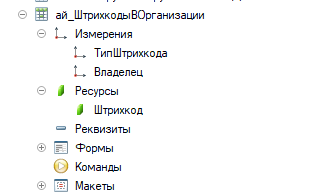

 [в начало](../readme.md)

**Домашнее задание 1**

1. Генерация кода в чате
Цель: посмотреть возможности чатов с моделями в части генерации небольших фрагментов кода. Попрактиковаться в генерации, последовательном уточнении задачи.

**ChatGPT.com**
ссылка на чат https://chatgpt.com/share/69faf752-917c-8389-83c2-81bcae9ef3e4

**Claude.ai**
ссылка на чат https://claude.ai/share/699ae968-fc42-426d-b64c-fde32c01adb7

**Gemini.Google.com**
ссылка на чат https://gemini.google.com/share/0d7dd84a1318

Выводы: 
- все чаты с моделями дают приемлимый результат на небольших задачах, корректно переделывают код учитывая замечания
- снабжают примерами использования
- claude сразу добавил проверку заполнения параметров
- gemini при отработке исключения использовал не существующую функцию, после замечания код стал корректным
- синтаксический контроль конечного результата в конфигураторе ошибок не обнаружил

2. Исследование

Для глубокого исследования использовал промпт из лекции deep_research.md, а также Глубокое исследование в веб интерфейсе chatgpt.com

Запрос:
В 1С универсальная доработка позволяющая общаться с ИИ в режиме чата. Чат красивый, привлекательный для пользователя. Можно задавать вопросы по одному если нужно.

Результат с deep_research.md в файле [deep-research-report.md](deep-research-report.md)

Результат с Глубокое исследование в веб интерфейсе chatgpt.com в файле [deep-research-report-chatgpt.md](deep-research-report-chatgpt.md)

Выводы:
Результат Глубокого исследования подробный, хорошо описывает идею, но мне больше понравился вариант с deep_research.md, он содержит пошаговую инструкции. При использовании deep_research.md gpt задал множество уточняющих вопросов, это и повлияло на конечный результат.

[в начало](../readme.md)

