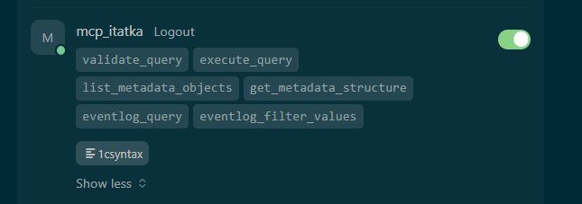
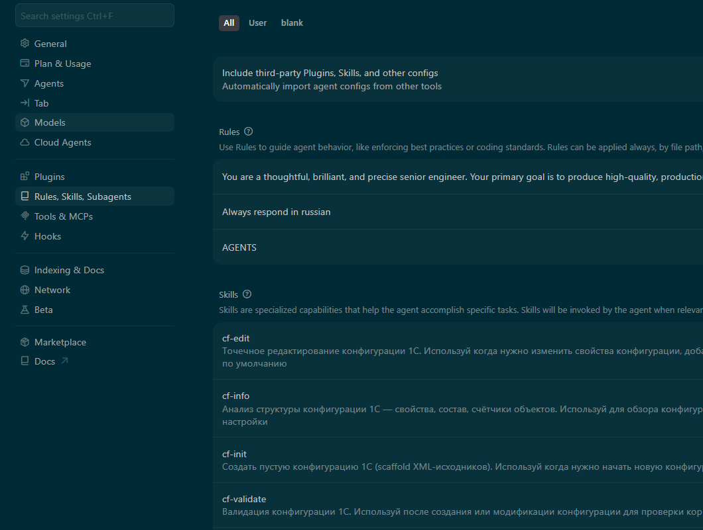
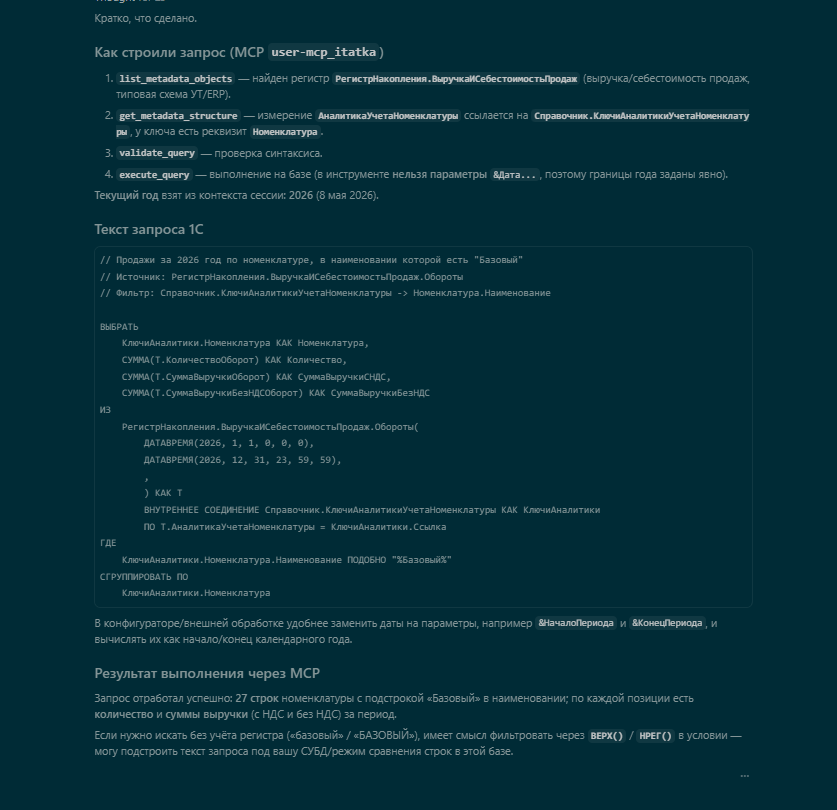

[в начало](../readme.md)

**Домашнее задание 5**

Цель ДЗ: подключить MCP-сервер для работы с метаданными и данными 1С, настроить правила проекта с учетом использования MCP.

Использовался Cursor

**Часть 1. Подключение MCP-сервера Задача Установить и подключить MCP-сервер к Cursor или Claude Code для доступа к метаданным и данным базы 1С.**

Что сделано:
- В базу КА добавлено расширение mcp_dev_1c
- Настроена отдельная публикация данного http, авторизация через bearer токен типовыми средствами платформы
- проведена тестовая проверка, запрос валют и их курса

конфигурация MCP

    "mcp_itatka": {
      "url": "http://int.local.ru:33080/itatka_mcp/hs/mcp",
      "headers": {
        "Authorization": "Bearer токен"
      }

**Часть 2. Настройка правил Задача Настроить пользовательские и проектные правила для вашего проекта 1С.**

Для настройки правил, скилов использовал https://github.com/comol/ai_rules_1c

**Часть 3. Практическая проверка Задача Проверить работу настроенного контекста на небольшой задаче.**

Задача: построй запрос продаж за текущий год по номенклатуре содержащей "Базовый", используй MCP

Запрос построен корректно, валидирован

[в начало](../readme.md)

